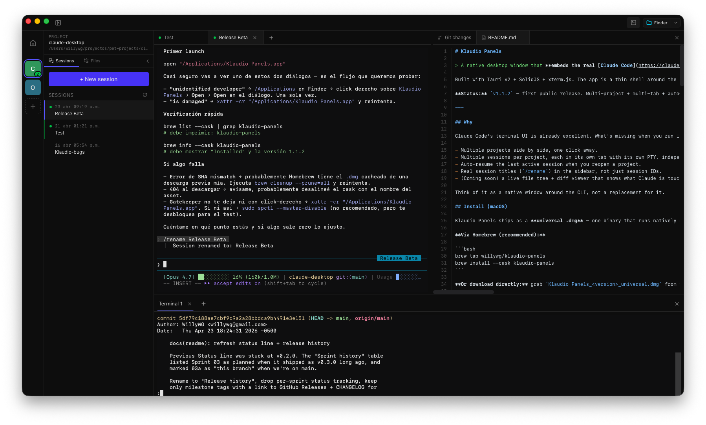
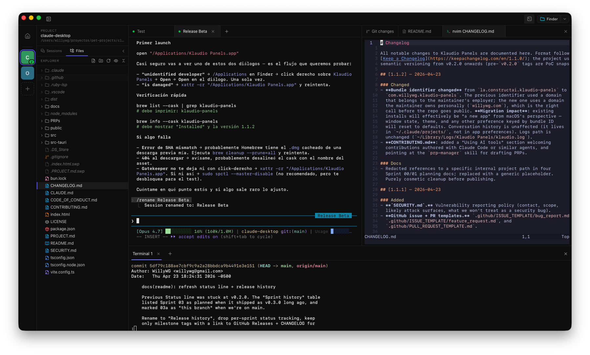

# Klaudio Panels

> A native desktop window that **embeds the real [Claude Code](https://claude.com/claude-code) CLI** via PTY, with a Slack-style projects sidebar, multi-tab sessions, and auto-resume.

Built with Tauri v2 + SolidJS + xterm.js. The app is a thin shell around the `claude` CLI — it does **not** reimplement Claude Code's UI, it embeds it. You get every CLI feature for free: slash commands, permission prompts, the `-r` session picker, autocomplete, hooks, colors, mouse tracking.

**Status:** `v1.1.2` — first public release. Multi-project + multi-tab + auto-resume, file tree with `notify` watcher, JSONL session watcher, `klaudio` shell command, and the Homebrew tap are all shipped. Diff viewer and code signing are the next milestones.

---

## Why

Claude Code's terminal UI is already excellent. What's missing when you run it in Terminal.app is a **shell around it**:

- Multiple projects side by side, one click away.
- Multiple sessions per project, each in its own tab with its own PTY, independent scrollback.
- Auto-resume the last active session when you reopen a project.
- Real session titles (`/rename`) in the sidebar, not just session IDs.
- A live file tree + a shell dock at the bottom of the window, so you can inspect files and run commands alongside your Claude session without leaving the app.
- **Terminal editors embedded in a secondary PTY.** Click any file in the tree → pick your editor → it opens in-window. Today: **Neovim**, **Vim**, **Helix**, **Micro**. Plus "Open in…" routing for GUI editors (VS Code, Cursor, Windsurf, Zed, JetBrains family, Xcode, Sublime, etc.) via `open -a`.
- (Coming soon) a diff viewer showing what Claude is touching, without parsing the PTY — we watch the filesystem and git instead.

Think of it as a native window around the CLI, not a replacement for it.

## Install (macOS)

Klaudio Panels ships as a **universal .dmg** — one binary that runs natively on both Apple Silicon and Intel Macs.

**Via Homebrew (recommended):**

```bash
brew tap willywg/klaudio-panels
brew install --cask klaudio-panels
```

**Or download directly:** grab `Klaudio Panels_<version>_universal.dmg` from the [latest release](https://github.com/willywg/klaudio-panels/releases/latest) and drag the app into `/Applications`.

## First launch

Klaudio Panels is **not yet signed with an Apple Developer ID** — see [Platform support](#platform-support) for why. On first launch, macOS will refuse to open the app and show one of these two warnings:

**"Klaudio Panels" can't be opened because it is from an unidentified developer**

1. Open `/Applications` in Finder.
2. **Right-click** (or Control-click) on **Klaudio Panels** → **Open**.
3. Click **Open** in the confirmation dialog.

After that one-time approval, the app launches normally like any other app.

**"Klaudio Panels" is damaged and can't be opened**

Run this once in Terminal:

```bash
xattr -cr "/Applications/Klaudio Panels.app"
```

Then open the app normally. This clears a macOS quarantine flag that sometimes lingers on unsigned downloads.

Both warnings are Gatekeeper defaults for unsigned apps, not signs that anything is wrong with the binary — the source is public and inspectable right here.

## Platform support

| OS | Status | Notes |
| --- | --- | --- |
| **macOS 14+** (Sonoma, Sequoia) | ✅ primary target | Tested on Apple Silicon and Intel. Universal `.dmg` is what the maintainer ships. |
| **Linux** | 🧪 untested | Should build via `bun tauri build` (Tauri is cross-platform). Help validating is very welcome — see [#1](https://github.com/willywg/klaudio-panels/issues/1). |
| **Windows** | ❌ not supported yet | Several backend modules are stubbed on Windows. Help porting is welcome — see [#2](https://github.com/willywg/klaudio-panels/issues/2). |

**About code signing.** Apple's Developer Program is US$99/year. We'll pay it once the project has real usage; until then, the first-launch workaround above is the cost of keeping the project free. Apple has been tightening the unsigned-app escape hatches with each macOS release, so this is a temporary state, not a permanent stance.

## Screenshots

**Sessions sidebar + inline Markdown preview with the shell dock at the bottom.**



**File tree on the left, Neovim embedded in a secondary PTY on the right, Claude session in the middle.**



## Notifications

Klaudio Panels surfaces three kinds of signals when a Claude session
needs your attention: a chime, a native macOS notification banner,
and an amber ring on the project's avatar in the sidebar (plus a Dock
badge counting how many projects are waiting). All three are
suppressed when you're already focused on the project the event came
from — they only fire for **background** activity.

> 🔔 **Recommended: install the warp plugin first.** Without it,
> Klaudio falls back to the noisier transcript-watcher path, which
> fires once per Claude turn (often several times a minute on long
> agentic work). With the plugin you get the cleaner
> `permission_request` channel — Claude pings you only when it's
> actually waiting for you. Five-second install, see [Permission
> requests (recommended warp plugin)](#permission-requests-recommended-warp-plugin).
>
> Want to mute or change which channels notify you? Click the bell in
> the titlebar → ⚙️ Settings — toggle Task complete, Permission
> requests, and Sounds independently.

### Permission requests (recommended warp plugin)

The transcript watcher cannot see when Claude wants to run a tool
(`Bash`, `Edit`, etc.) that requires your approval — that signal
never gets written to disk. To catch those, install the [warp Claude
Code plugin](https://github.com/warpdotdev/claude-code-warp). It
emits [OSC 777 sidechannel events](https://github.com/warpdotdev/warp/blob/main/app/src/terminal/cli_agent_sessions/event/v1.rs)
that Klaudio Panels parses out of the PTY stream. The same plugin
also works in [warp.app](https://www.warp.dev/) and any other terminal
that speaks the `warp://cli-agent` protocol — install once, get
notifications everywhere.

```bash
# Requires `jq` on PATH (brew install jq if missing)
claude plugin marketplace add warpdotdev/claude-code-warp
claude plugin install warp@claude-code-warp
```

Restart your Claude session afterwards so the plugin loads. From then
on, permission requests get a more attention-grabbing chime + a
banner on top of the built-in turn-completion notifications.

### Built-in fallback (zero-config)

Out of the box, Klaudio Panels watches the Claude transcript files
under `~/.claude/projects/` and notifies you whenever a session ends
its turn. This works for every Claude session you run inside Klaudio,
no extra setup needed — but Claude reaches "end of turn" after every
tool-free reply, which means several notifications per minute on
busy work. The warp plugin (above) is the cleaner signal; this path
is the safety net if you can't install it. You can also disable it
entirely from the bell's ⚙️ Settings panel.

> The plugin also emits an `idle_prompt` event every 60s while the
> Claude prompt sits empty (which fires while you're *reading*
> output too). Klaudio drops it server-side because it's noise, not
> signal — `permission_request` already covers the actually-blocked
> case.

> Why this approach? Klaudio's [non-negotiable
> rule #2](./CLAUDE.md) is to never parse Claude's terminal
> output — it's brittle across Claude versions. OSC 777 with the
> `warp://cli-agent` sentinel is a different beast: a stable, public,
> versioned wire contract. Klaudio's sniffer in
> `src-tauri/src/cli_agent.rs` observes those frames without mutating
> the byte stream (xterm.js still renders the terminal exactly as
> Claude sent it).

## Architecture at a glance

```
┌─────────────────────────────────────────────────┐
│  Tauri v2 Window (Rust)                         │
│                                                 │
│  ┌───────────────────────────────────────────┐  │
│  │  SolidJS UI (webview)                     │  │
│  │  ┌────────┬─────────┬──────────────────┐  │  │
│  │  │Projects│Sessions │  xterm.js        │  │  │
│  │  │sidebar │sidebar  │  (renders PTY)   │  │  │
│  │  └────────┴─────────┴──────────────────┘  │  │
│  └───────────────────────────────────────────┘  │
│                                                 │
│  Rust backend                                   │
│  ├─ binary.rs    : detect `claude` on PATH      │
│  ├─ shell_env.rs : hydrate login shell env      │
│  ├─ sessions.rs  : read ~/.claude/projects/*    │
│  └─ pty.rs       : portable-pty spawn + stream  │
└─────────────────────────────────────────────────┘
```

Key rules (see `CLAUDE.md` for the full set):

- **Claude runs interactively in a PTY.** No `-p`, no `--output-format`. xterm.js renders bytes as-is.
- **We never parse the PTY output.** If a feature seems to need it, we watch the filesystem + git instead.
- **Shell env hydration is mandatory.** macOS GUI apps inherit a stripped PATH; we merge the login shell's env so `node`, `nvm`, `git`, `rg` work inside Claude's Bash tool.
- **Sessions live in `~/.claude/projects/`.** We read JSONL files for sidebar previews; we never write there.
- **Each tab is its own PTY.** Switching tabs toggles visibility (never re-creates xterm, to preserve scrollback + WebGL).
- **Persistence is minimal.** `localStorage` for `lastSessionId:<projectPath>`. SQLite is for later.

Full design doc: [`PROJECT.md`](./PROJECT.md).

## Prerequisites

- [Bun](https://bun.com) 1.3+
- [Rust](https://rustup.rs) stable toolchain
- The [`claude` CLI](https://docs.anthropic.com/en/docs/claude-code) installed and authenticated (run `claude` once in a terminal first).
- macOS is the primary development target. See [Platform support](#platform-support) for Linux / Windows status.

## Development

```bash
bun install
bun tauri dev
```

First cold Rust build: ~3–5 minutes. After that HMR is instant.

Other useful commands:

```bash
bun run typecheck               # tsc --noEmit
cd src-tauri && cargo check
cd src-tauri && cargo clippy -- -D warnings
```

## Building a release

On macOS, build a **universal** binary (native on both Apple Silicon and Intel):

```bash
rustup target add aarch64-apple-darwin x86_64-apple-darwin   # one-time
bun run release:mac
```

Artifacts land under `src-tauri/target/universal-apple-darwin/release/bundle/`.

Building with a plain `bun tauri build` is fine for local smoke-testing, but **don't ship it** — it produces a host-arch-only binary, which on an x86_64 toolchain means Intel-only, and Apple Silicon users will run it under Rosetta and see macOS's "End of support for Intel-based apps" warning.

On Windows / Linux, `bun tauri build` is still the right command; artifacts land under `src-tauri/target/release/bundle/`.

_Note: release builds are not yet signed with an Apple Developer ID. End-users hit a Gatekeeper warning on first launch — see [First launch](#first-launch) for the one-time workaround._

## Release history

Milestones only — intermediate tags (`v0.4.x` through `v0.9.x`) covered polish and bug fixes on the Sprint 02/03 feature set. Full detail in [`CHANGELOG.md`](./CHANGELOG.md); every tag is at [GitHub Releases](https://github.com/willywg/klaudio-panels/releases).

| Tag                      | Milestone                                                        | Status      |
| ------------------------ | ---------------------------------------------------------------- | ----------- |
| `v0.0.1-stream-json-poc` | Sprint 00 — stream-json PoC, pivoted to PTY                      | ✅ archived |
| `v0.1.0-pty`             | Sprint 01 — `claude` in PTY, single tab, sidebar sessions        | ✅ shipped  |
| `v0.2.0`                 | Sprint 02 — multi-tab, multi-project, auto-resume                | ✅ shipped  |
| `v0.3.0`                 | Sprint 03 — file tree, `notify` watcher, JSONL session watcher   | ✅ shipped  |
| `v1.0.0`                 | Rename "Klaudio UI" → "Klaudio Panels"                           | ✅ shipped  |
| `v1.1.0`                 | `klaudio` shell command + `klaudio://` URL scheme                | ✅ shipped  |
| `v1.1.2`                 | **First public release** — Homebrew tap, OSS hygiene, bundle id  | ✅ shipped  |
| next                     | Sprint 04 — diff viewer (`@pierre/diffs`)                        | 🔜 planned  |
| later                    | Code signing + notarization (Apple Developer Program)            | 🔜 planned  |

Retros live in [`docs/`](./docs/); PRPs in [`PRPs/`](./PRPs/).

## Troubleshooting

Klaudio Panels writes a diagnostic log on every run. If something goes
wrong, grab it before filing an issue:

**macOS** — `~/Library/Logs/Klaudio Panels/klaudio.log`

```bash
tail -n 200 "$HOME/Library/Logs/Klaudio Panels/klaudio.log"
open "$HOME/Library/Logs/Klaudio Panels"   # reveal in Finder
```

**Linux** — `~/.klaudio-panels/logs/klaudio.log`

```bash
tail -n 200 "$HOME/.klaudio-panels/logs/klaudio.log"
```

Please redact anything you'd rather not share (project paths, usernames,
tokens). The bug report template has a slot for the log chunk.

## Contributing

See [`CONTRIBUTING.md`](./CONTRIBUTING.md). In short:

- All repo artifacts (code, comments, docs, PRs, issues, commits) in **English**.
- Open an issue before a large PR so we can agree on scope.
- Conventional commits (`feat:`, `fix:`, `docs:`, `refactor:`, `chore:`).
- Run `bun run typecheck` + `cargo check` + `cargo clippy -- -D warnings` before pushing.

## Credits

- **[Claude Code](https://claude.com/claude-code)** — the CLI we embed. Without it, there's no app.
- **[OpenCode Desktop](https://github.com/anomalyco/opencode)** — the reference architecture for embedding a CLI in a Tauri native window. We borrowed the `probe_shell_env` / `load_shell_env` / `merge_shell_env` pattern verbatim from their `packages/desktop/src-tauri/src/cli.rs`.
- **[Claudia](https://github.com/getAsterisk/claudia)** — used during the Sprint 00 stream-json PoC for `claude` binary detection and JSONL parsing patterns.

## License

[MIT](./LICENSE) © 2026 William Wong Garay
